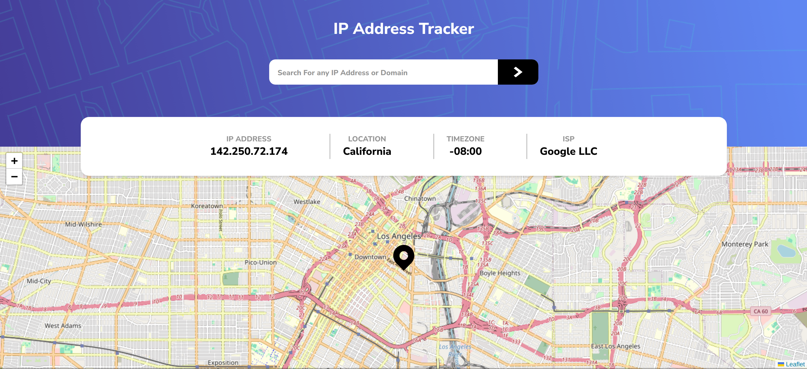

# Frontend Mentor - IP address tracker solution

This is a solution to the [IP address tracker challenge on Frontend Mentor](https://www.frontendmentor.io/challenges/ip-address-tracker-I8-0yYAH0). Frontend Mentor challenges help you improve your coding skills by building realistic projects.

## Table of contents

- [Overview](#Overview)
  - [The challenge](#the-challenge)
  - [Screenshot](#screenshot)
  - [Links](#links)
- [My process](#my-process)
  - [Built with](#built-with)
  - [What I learned](#what-i-learned)
  - [Continued development](#continued-development)
  - [Useful resources](#useful-resources)
- [Author](#author)

## Overview

This Project Basically Consits of Building this Frontend Mentor - IP address tracker solution

### The challenge

Users should be able to:

- View the optimal layout for each page depending on their device's screen size
- See hover states for all interactive elements on the page
- See their own IP address on the map on the initial page load
- Search for any IP addresses or domains and see the key information and location

### Screenshot



### Links

- Solution URL: [https://github.com/lankiman/ip-address-tracker](https://github.com/lankiman/ip-address-tracker)
- Live Site URL: [https://ip-address-tracker-lankiman.vercel.app/](https://ip-address-tracker-lankiman.vercel.app/)

## My process

### Built with

- TailwindCss
- Mobile-first workflow
- [React](https://reactjs.org/) - JS library
- Vite

### What I learned

I learend a Lot in this Proejct, from Consuming data from an api, handling possible error, and intergrating leaflet with React

```ts
async function fetchData() {
  setLoading(true);
  try {
    const response = await fetch(url);
    const data = await response.json();
    if (response.status === 200) {
      setAddress(data);
      setLoading(false);
      setError(0);
    } else {
      setLoading(false);
      if (response.status === 403) {
        setError(2);
      } else {
        setError(1);
      }
    }
  } catch (error) {
    setLoading(false);
    setError(2);
  }
}
```

```tsx
<MapContainer
  center={[address.location?.lat, address.location?.lng]}
  className="h-full"
  zoom={13}
>
  <TileLayer url="https://{s}.tile.openstreetmap.org/{z}/{x}/{y}.png" />
  <Marker
    position={[address.location?.lat, address.location?.lng]}
    icon={icon}
  />
</MapContainer>
```

### Continued development

I Would Basically want to increase on my Tailwind Css skills, while working on this project i came across several tailwind tips, which i look to implement on my next project. And also my Typescript, there are some issues in type definations that i would not able to resolve to my satisfaction i look on improving on them

### Useful resources

- [Leaflet Tutorial](https://www.youtube.com/watch?v=jD6813wGdBA) - This helped me in setting up the map, i would recommend to anyone trying to use leaflet with react

## Author

- Github - [@lankiman](https://www.github.com/lankiman)
- LinkedIn - [Marvellous Gboun](www.linkedin.com/in/marvellous-gboun)
- Frontend Mentor - [@lankiman](https://www.frontendmentor.io/profile/lankiman)
- Twitter - [@Lanki_Man](https://www.twitter.com/Lanki_Man)
